

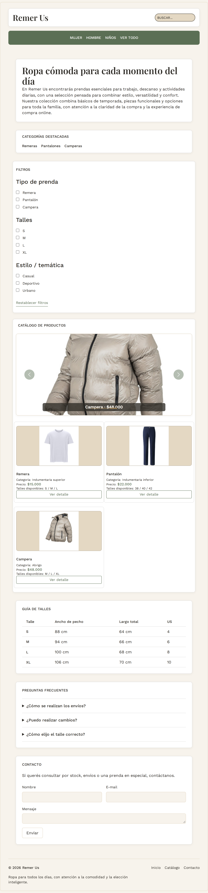

# Test Case 7 — Carousel de destacados (Bootstrap)

- **Fecha:** 2026-10-07
- **Responsable:** @LucasFUces (Especialista en Componentes Bootstrap)
- **Componente:** Carousel Bootstrap 5.3.8, `#carouselDestacados` en `index.html`
- **Issue del rol:** [#61](https://github.com/dantebiondi666-prog/tienda-online/issues/61)
- **Rama:** `feature/esp-componentes-bootstrap-add-components`
- **Resultado global:** PASS (sin bugs encontrados)

## Objetivo
Verificar que el Carousel de destacados (3 productos) funciona y se ve bien en tres dispositivos, sin overflow horizontal ni imágenes deformadas.

## Entorno
- Sitio servido con `npx serve -l 3000 .` (http://localhost:3000)
- Chromium headless con Playwright, vía script de pruebas (retirado luego del repositorio a pedido del equipo)
- Resultados completos: tablas de este documento y capturas en `docs/04-testing/capturas/`

| Dispositivo | Viewport | Escala |
|---|---|---|
| iPhone 14 Pro | 393x852 | 3 |
| Samsung Galaxy S23 | 360x780 | 3 |
| iPad Air | 820x1180 | 2 |

## Prompt utilizado
**Intento 1 — Playwright MCP (sin éxito).** Se envió este prompt al Agent de Copilot:

```text
Usando exclusivamente las tools del servidor Playwright MCP, abrí http://localhost:3000 y probá el Carousel Bootstrap (#carouselDestacados) en tres viewports: iPhone 14 Pro (393x852), Samsung Galaxy S23 (360x780) e iPad Air (820x1180). En cada uno: 1) sacá una captura de pantalla completa y guardala en docs/04-testing/capturas/ con nombre carousel-<dispositivo>.png; 2) verificá que haya 3 diapositivas, que el botón siguiente y los indicadores cambien de diapositiva y que el botón anterior vuelva; 3) medí si hay scroll horizontal (document.documentElement.scrollWidth mayor que clientWidth); 4) verificá que las imágenes no se deformen. Al final dame una tabla con dispositivo, prueba, resultado esperado, resultado real y estado, y listá cada problema encontrado con pasos para reproducirlo. No arregles nada todavía.
```

**Resultado del intento 1:** el Agent respondió que las tools del servidor Playwright MCP no estaban disponibles en la sesión y no ejecutó nada. El servidor figuraba "en ejecución" en VS Code, pero sus herramientas no llegaron al chat.

**Intento 2 — Playwright por script.** Se reprodujo la misma batería de pruebas con un script Node (retirado luego del repositorio a pedido del equipo), generado con asistencia de IA (Claude) y revisado por el equipo. Se ejecutó con Node.js.

## Casos de prueba y resultados
Se ejecutaron las mismas 6 pruebas en los 3 dispositivos (18 en total).

| Prueba | Resultado esperado | iPhone 14 Pro | Galaxy S23 | iPad Air |
|---|---|---|---|---|
| Cantidad de diapositivas | 3 | 3 — OK | 3 — OK | 3 — OK |
| Botón siguiente | avanza una diapositiva | OK | OK | OK |
| Botón anterior | vuelve a la diapositiva inicial | OK | OK | OK |
| Indicador 3 | muestra la diapositiva 3 | OK | OK | OK |
| Imágenes sin deformar | ninguna deformada | OK | OK | OK |
| Sin scroll horizontal | scrollWidth <= clientWidth | OK | OK | OK |

## Capturas
- 
- 
- 

## Issues de bug
Ninguna. Las 18 pruebas pasaron y no se detectaron problemas reales, por lo que no se abrieron issues `bug` ni ramas `fix/`.

## Alcance y limitaciones
- El autoplay se pausó durante la prueba para controlar la diapositiva activa.
- La verificación de imágenes deformadas se basa en `object-fit` y proporción natural vs. renderizada; las capturas se revisaron manualmente.
- No se probó con lectores de pantalla ni en navegadores distintos de Chromium.

## Re-ejecución sobre develop integrado
Después de integrar `develop` (que incorporó `<details>` y `<datalist>` del rol de HTML avanzado), se volvió a correr el script y se regeneraron las capturas. Resultado: las 18 pruebas del Carousel dieron OK en los 3 viewports.

## Limitaciones y pendientes
- **Swipe:** no se probó. El script no simula gestos táctiles, por lo que el criterio de swipe del spec queda sin verificar.
- **Safari / iOS:** no se probó. Los dispositivos se emularon con viewports en Chromium, no con Safari ni con dispositivos reales.
- **Playwright MCP:** no estuvo disponible en el Codespace durante esta entrega. Las pruebas se hicieron con script.
