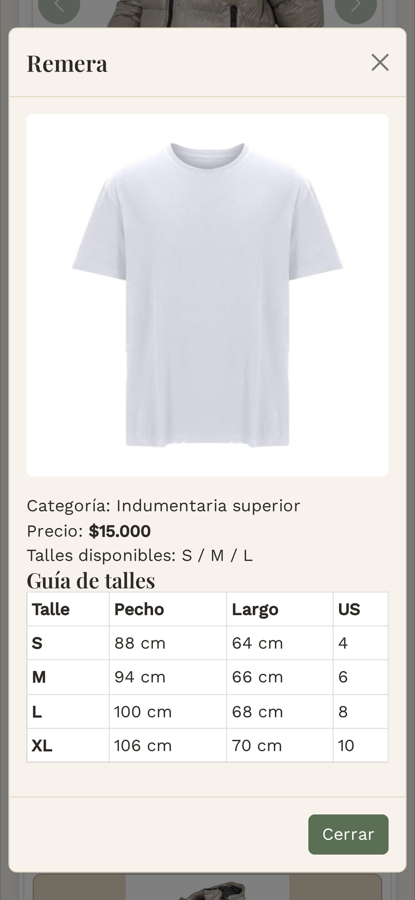
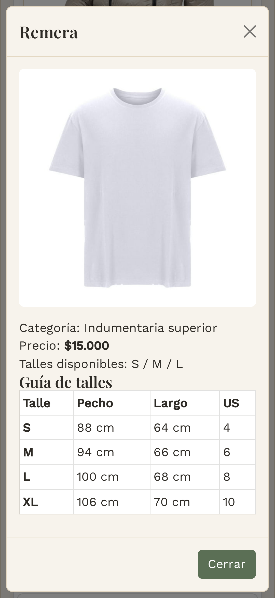
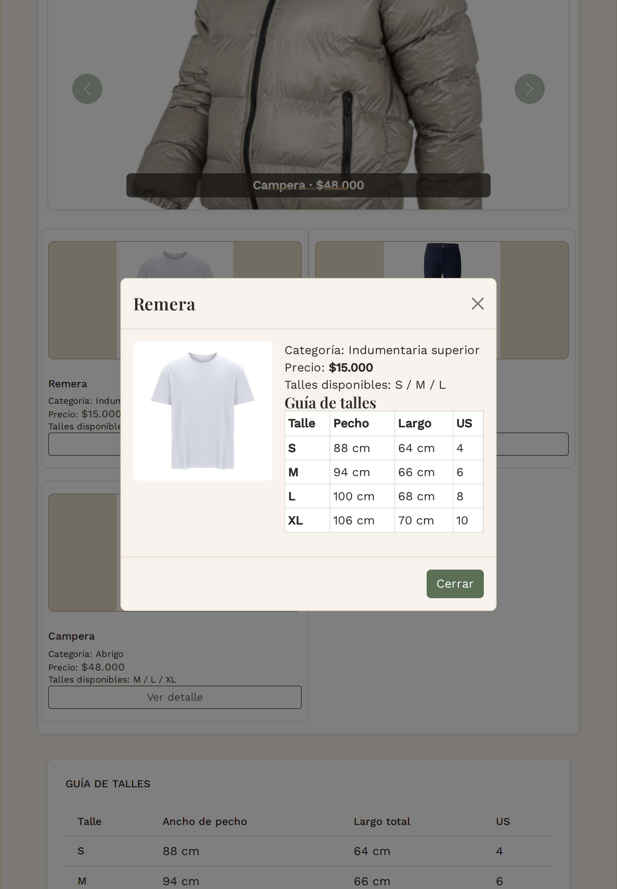

# Test Case 8 — Modal de detalle de producto (Bootstrap)

- **Fecha:** 2026-10-07
- **Responsable:** @LucasFUces (Especialista en Componentes Bootstrap)
- **Componente:** Modal Bootstrap 5.3.8, `#modalProducto` en `index.html`, abierto desde "Ver detalle"
- **Issue del rol:** [#61](https://github.com/dantebiondi666-prog/tienda-online/issues/61)
- **Rama:** `feature/esp-componentes-bootstrap-add-components`
- **Resultado global:** PASS (bug de contenido #64 corregido posteriormente)

## Objetivo
Verificar que el modal abre con los datos del producto correcto, cierra de las tres formas esperadas, devuelve el foco al botón y no genera scroll horizontal en tres dispositivos.

## Entorno
Igual que el Test Case 7 (http://localhost:3000, Chromium con Playwright, mismos tres viewports).

## Prompt utilizado
**Intento 1 — Playwright MCP (sin éxito).** Prompt exacto enviado al Agent de Copilot:

```text
Usando Playwright MCP, en http://localhost:3000 probá el Modal Bootstrap (#modalProducto) en los mismos tres viewports: iPhone 14 Pro (393x852), Samsung Galaxy S23 (360x780) e iPad Air (820x1180). En cada uno: 1) hacé clic en "Ver detalle" de cada una de las tres tarjetas y verificá que el título, la imagen, el precio y los talles correspondan a ese producto; 2) sacá una captura con el modal abierto y guardala en docs/04-testing/capturas/ como modal-<dispositivo>.png; 3) verificá que cierre con la X, con clic en el fondo y con la tecla Escape; 4) verificá que el foco vuelva al botón "Ver detalle" al cerrar y que la tabla de talles no genere scroll horizontal. Dame la misma tabla de resultados y listá cada problema con pasos para reproducirlo. No arregles nada todavía.
```

**Resultado del intento 1:** el Agent respondió que no tenía las tools del servidor Playwright MCP disponibles y no ejecutó nada.

**Intento 2 — Playwright por script.** Las mismas verificaciones se ejecutaron con el script de pruebas (retirado luego del repositorio a pedido del equipo)  (script generado con asistencia de IA y revisado por el equipo).

## Casos de prueba y resultados

| Prueba | Resultado esperado | iPhone 14 Pro | Galaxy S23 | iPad Air |
|---|---|---|---|---|
| Botones "Ver detalle" | 3 | OK | OK | OK |
| Abre tarjeta 1 / 2 / 3 | modal visible con título | OK | OK | OK |
| Sin scroll horizontal (tarjetas 1, 2 y 3) | sin scroll | OK | OK | OK |
| Cierra con X | modal cerrado | OK | OK | OK |
| Foco vuelve al botón "Ver detalle" | foco en el botón | OK | OK | OK |
| Cierra con clic en el fondo | modal cerrado | OK | OK | OK |
| Cierra con Escape | modal cerrado | OK | OK | OK |

## Contenido mostrado por tarjeta
Idéntico en los tres dispositivos:

| Tarjeta | Título | Imagen | Precio | Talles |
|---|---|---|---|---|
| 1 | Remera | `assets/img/remera-blanca.jpg` | $15.000 | S / M / L |
| 2 | Pantalón | `assets/img/pantalon-azul.webp` | $22.000 | 38 / 40 / 42 |
| 3 | Campera | `assets/img/campera-beige.jpg` | $48.000 | M / L / XL |

## Capturas (modal abierto, tarjeta 1)
- 
- 
- 


## Alcance y limitaciones
- Los datos mostrados (título, imagen, precio y talles) se verificaron en las tres tarjetas. Las capturas del modal son de la tarjeta 1.
- El cierre con X, fondo y Escape y el retorno del foco se probaron una vez por dispositivo, sobre la tarjeta 1.
- La prueba automática no compara el contenido del modal con el de la tarjeta; esa comparación se hizo mirando los resultados.

## Re-ejecución sobre develop integrado
Después de integrar `develop`, se volvió a correr el script y se regeneraron las capturas. Resultado: las 33 pruebas del Modal dieron OK en los 3 viewports.

## Issue de bug

- [#64](https://github.com/dantebiondi666-prog/tienda-online/issues/64): la guía de talles estática del modal no coincidía con los talles reales del Pantalón.

### Corrección aplicada

Se eliminó la tabla de guía de talles estática del modal, ya que mostraba la misma información para productos con sistemas de talles diferentes. El modal conserva los talles disponibles obtenidos directamente de cada producto seleccionado.

Luego de la corrección se verificó manualmente que:
- Remera muestra S / M / L.
- Pantalón muestra 38 / 40 / 42.
- Campera muestra M / L / XL.
- El foco permanece dentro del modal al navegar con Tab y Shift + Tab.
- Escape cierra el modal.
- Al cerrar, el foco vuelve al botón "Ver detalle" que abrió el modal.

## Limitaciones y pendientes
- **Safari / iOS:** no se probó. Los dispositivos se emularon con viewports en Chromium.
- **Teclado:** se verificó manualmente la navegación con Tab y Shift + Tab dentro del modal, el cierre con Escape y el retorno del foco al botón que abrió el modal.
- **Playwright MCP:** no estuvo disponible en el Codespace durante esta entrega. Las pruebas se hicieron con script.
