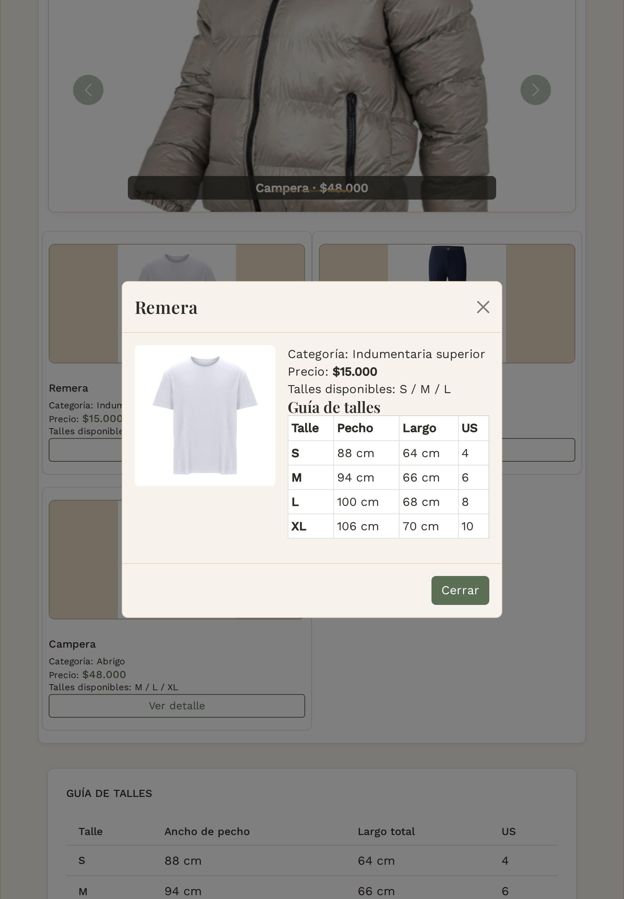

# Test Case 8 — Modal de detalle de producto (Bootstrap)

- **Fecha:** 2026-10-07
- **Responsable:** @LucasFUces (Especialista en Componentes Bootstrap)
- **Componente:** Modal Bootstrap 5.3.8, `#modalProducto` en `index.html`, abierto desde "Ver detalle"
- **Issue del rol:** [#61](https://github.com/dantebiondi666-prog/tienda-online/issues/61)
- **Rama:** `feature/esp-componentes-bootstrap-add-components`
- **Resultado global:** PASS (sin bugs del componente; una observación de contenido)

## Objetivo
Verificar que el modal abre con los datos del producto correcto, cierra de las tres formas esperadas, devuelve el foco al botón y no genera scroll horizontal en tres dispositivos.

## Entorno
Igual que el Test Case 7 (http://localhost:3000, Chromium con Playwright, mismos tres viewports).

## Prompt utilizado
**Intento 1 — Playwright MCP (sin éxito).** Se usó el prompt del modal: tres viewports, clic en "Ver detalle" de cada tarjeta, captura con modal abierto, cierre con X, fondo y Escape, y verificación del foco y del scroll horizontal. El Agent respondió que no tenía las tools del servidor Playwright MCP disponibles y no ejecutó nada.

**Intento 2 — Playwright por script.** Las mismas verificaciones se ejecutaron con `docs/04-testing/probar-componentes.cjs` (script generado con asistencia de IA y revisado por el equipo).

## Casos de prueba y resultados

| Prueba | Resultado esperado | iPhone 14 Pro | Galaxy S23 | iPad Air |
|---|---|---|---|---|
| Botones "Ver detalle" | 3 | OK | OK | OK |
| Abre tarjeta 1 / 2 / 3 | modal visible con título | OK | OK | OK |
| Sin scroll horizontal (tarjetas 1, 2 y 3) | sin scroll | OK | OK | OK |
| Cierra con X | modal cerrado | OK | OK | OK |
| Foco vuelve al botón "Ver detalle" | foco en el botón | OK | OK | OK |
| Cierra con clic en el fondo | modal cerrado | OK | OK | OK |
| Cierra con Escape | modal cerrado | OK | OK | OK |

## Contenido mostrado por tarjeta
Idéntico en los tres dispositivos:

| Tarjeta | Título | Imagen | Precio | Talles |
|---|---|---|---|---|
| 1 | Remera | `assets/img/remera-blanca.jpg` | $15.000 | S / M / L |
| 2 | Pantalón | `assets/img/pantalon-azul.webp` | $22.000 | 38 / 40 / 42 |
| 3 | Campera | `assets/img/campera-beige.jpg` | $48.000 | M / L / XL |

## Capturas (modal abierto, tarjeta 1)
- 
- 
- 

## Issues de bug
Ninguna. No se abrieron issues `bug` ni ramas `fix/`.

## Observación (no es un bug del componente)
La guía de talles del modal muestra la misma tabla (S, M, L, con medidas y talle US) para los tres productos. Para el Pantalón, cuyos talles son 38 / 40 / 42, esa tabla no coincide. Es una inconsistencia de contenido y no afecta el funcionamiento del modal. Se deja registrada como mejora futura.

## Alcance y limitaciones
- Los datos mostrados (título, imagen, precio y talles) se verificaron en las tres tarjetas. Las capturas del modal son de la tarjeta 1.
- El cierre con X, fondo y Escape y el retorno del foco se probaron una vez por dispositivo, sobre la tarjeta 1.
- La prueba automática no compara el contenido del modal con el de la tarjeta; esa comparación se hizo mirando los resultados.
