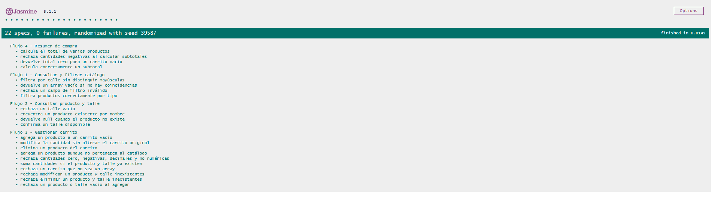
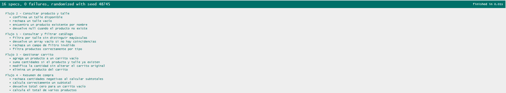
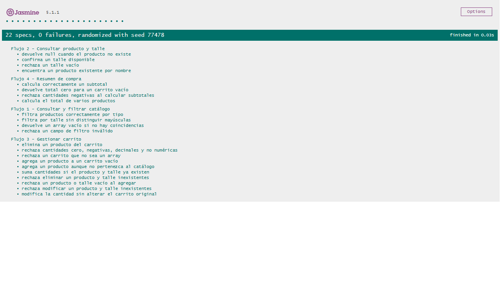
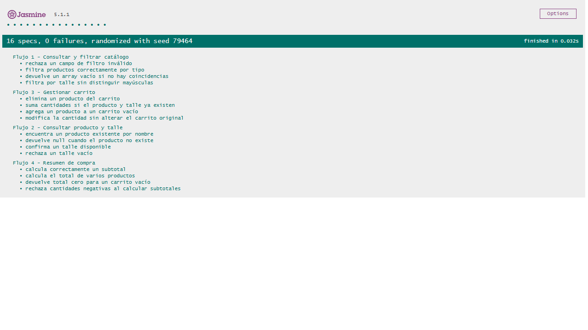
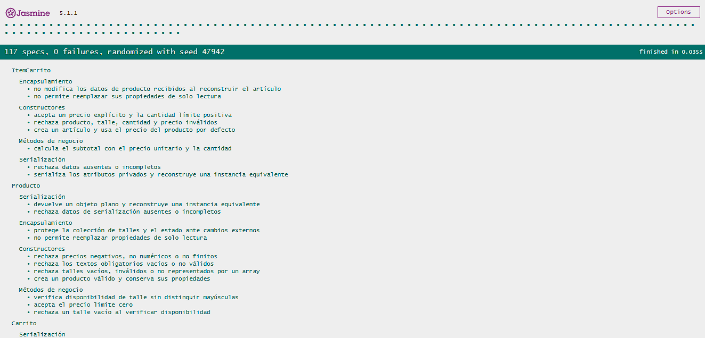
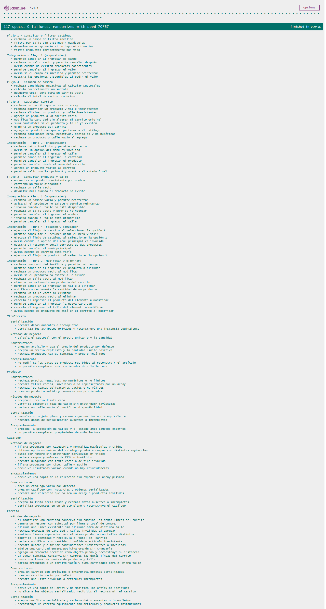

# Informe de Testing JavaScript — Jasmine

## 1. Información general

- **Proyecto:** Remer Us — Tienda Online
- **Materia:** Programación Web I
- **Entrega:** Actividad Obligatoria N.º 3
- **Responsable:** Juan Martin Britos
- **Rol:** Tester JavaScript / QA Engineer
- **Framework:** Jasmine 5.1.1
- **Herramienta de automatización:** Playwright MCP
- **Fecha de ejecución:** 30/10/2026
- **Issue asociada:** #88
- **Rama:** `feature/tester-javascript-jasmine`

## 2. Objetivo

Verificar mediante pruebas automatizadas el correcto funcionamiento de las operaciones JavaScript implementadas para el simulador de tienda online Remer Us.

Se evaluaron cuatro flujos funcionales: consulta y filtrado del catálogo, consulta de productos y talles, gestión del carrito y cálculo del resumen de compra.

## 3. Archivos involucrados

- `js/script.js`: código JavaScript bajo prueba.
- `js/test/test-runner.html`: ejecutor de Jasmine.
- `js/test/script.spec.js`: suites y casos de prueba.
- `js/test/capturas/`: evidencias visuales.
- `js/test/testing-doc.md`: presente informe.

## 4. Suites ejecutadas

| Suite | Funcionalidad | Tests | Resultado |
|---|---|---:|---|
| 1 | Consultar y filtrar catálogo | 4 | PASS |
| 2 | Consultar producto y talle | 4 | PASS |
| 3 | Gestionar carrito | 10 | PASS |
| 4 | Resumen de compra | 4 | PASS |
| **Total** | **4 flujos funcionales** | **22** | **PASS** |

**Resultado final vigente:** 4 suites ejecutadas, 22 tests aprobados
y 0 fallidos, verificados mediante Jasmine 5.1.1 y Playwright MCP.

La ejecución inicial contemplaba 16 tests. Durante las correcciones
de la PR #91 se incorporaron seis pruebas adicionales a la Suite 3.

## 5. Casos de prueba

### Suite 1 — Consultar y filtrar catálogo

1. Filtrar productos correctamente por tipo.
2. Filtrar por talle sin distinguir mayúsculas.
3. Devolver un array vacío cuando no existen coincidencias.
4. Rechazar un campo de filtro inválido.

**Resultado:** 4/4 PASS.

### Suite 2 — Consultar producto y talle

1. Encontrar un producto existente por nombre.
2. Devolver `null` cuando el producto no existe.
3. Confirmar la disponibilidad de un talle.
4. Rechazar una cadena vacía como talle.

**Resultado:** 4/4 PASS.

### Suite 3 — Gestionar carrito

Se ejecutaron diez pruebas automatizadas para verificar
las operaciones del carrito, incluyendo casos normales,
casos borde y entradas inválidas.

1. Agregar un producto a un carrito vacío.
2. Sumar cantidades cuando el producto y talle ya existen.
3. Modificar la cantidad sin alterar el carrito original.
4. Eliminar un producto del carrito.
5. Verificar que se puede agregar un producto aunque no pertenezca al catálogo.
6. Rechazar cantidades cero, negativas, decimales y no numéricas.
7. Rechazar un producto o talle vacío al agregar.
8. Rechazar un carrito que no sea un array.
9. Rechazar la modificación de un producto y talle inexistentes.
10. Rechazar la eliminación de un producto y talle inexistentes.

**Resultado:** 10/10 PASS.

Los seis casos adicionales fueron incorporados mediante
GitHub Copilot Agent, utilizando `js/script.js` como contexto.

Se documentó que `agregarAlCarrito()` permite agregar productos
que no pertenecen al catálogo. Esta prueba registra el
comportamiento actual de la función, sin modificar
el código de negocio.

### Suite 4 — Resumen de compra

1. Calcular correctamente el subtotal.
2. Devolver cero para un carrito vacío.
3. Calcular el total de varios productos.
4. Rechazar cantidades negativas.

**Resultado:** 4/4 PASS.

## 6. Ejecución manual con Jasmine

Se inició el servidor local y se accedió al ejecutor de Jasmine mediante:

`http://localhost:3000/js/test/test-runner.html`

Se ejecutaron las cuatro suites funcionales utilizando Jasmine 5.1.1.

**Resultados finales obtenidos:**

- Suites ejecutadas: 4.
- Tests ejecutados: 22.
- Tests aprobados: 22.
- Tests fallidos: 0.
- Resultado general: PASS.

**Evidencia final:**



**Antecedente histórico:**

La primera ejecución comprendía 16 tests, todos aprobados.
Posteriormente se incorporaron seis pruebas adicionales a la
Suite 3 como parte de las correcciones de la PR #91.



## 7. Ejecución automatizada con Playwright MCP

Se utilizó GitHub Copilot Agent junto con Playwright MCP
para abrir el ejecutor de Jasmine y verificar los resultados
de las pruebas automatizadas.

Luego de incorporar seis pruebas adicionales a la Suite 3,
se realizó una nueva ejecución para validar los resultados finales.

**Resultados confirmados mediante Playwright MCP:**

- Suites ejecutadas: 4.
- Tests ejecutados: 22.
- Tests aprobados: 22.
- Tests fallidos: 0.
- Resultado general: PASS.

**Evidencia final:**



**Antecedente histórico:**

La ejecución inicial mediante Playwright MCP verificó
16 tests aprobados. Posteriormente se amplió la cobertura
hasta alcanzar los 22 tests definitivos.



## 8. Incidencias y observaciones

Durante la ejecución automatizada mediante Playwright MCP
se registró una respuesta HTTP 404 correspondiente al
recurso `/favicon.ico`.

Se identificó que este mensaje estaba relacionado con la
ausencia del ícono del sitio y no con las funciones JavaScript
evaluadas mediante Jasmine.

La incidencia no afectó la ejecución de las pruebas ni
los resultados obtenidos.

**Resultados finales:**

- Suites ejecutadas: 4.
- Tests ejecutados: 22.
- Tests aprobados: 22.
- Tests fallidos: 0.
- Errores funcionales detectados: ninguno en los casos evaluados.

No quedaron incidencias pendientes relacionadas con
la ejecución de Jasmine.


## 9. Alcance, cobertura formal y limitaciones


### 9.1 Alcance de las pruebas

En la Actividad Obligatoria N.º 3 se implementaron
inicialmente 22 pruebas unitarias para verificar la
lógica de negocio de los cuatro flujos funcionales.

Durante la auditoría de la AO3, realizada en la
Pull Request #93, se incorporaron 43 pruebas de
integración de los orquestadores mediante mocks
de `prompt()` y `alert()` utilizando Jasmine.

Las pruebas de integración incluyen:

- RC4: 6 pruebas del filtrado del catálogo.
- RC5: 7 pruebas de consulta de productos y talles.
- RC6: 22 pruebas de gestión del carrito.
- RC7: 8 pruebas del resumen de compra y menú principal.

**Resultado conjunto:** 65 tests ejecutados,
65 PASS y 0 FAIL.


### 9.2 Medición formal de cobertura — RC8

Se utilizó la herramienta `c8` para medir la cobertura
formal del archivo `js/script.js`, ejecutando las
pruebas unitarias y de integración mediante Jasmine.

Las dependencias y el comando de cobertura están
configurados en `package.json`.

Para instalar las dependencias:

```bash
npm install
```

Para ejecutar las pruebas y generar el reporte:

```bash
npm run cobertura
```

En Windows PowerShell, si la política de ejecución
bloquea `npm.ps1`, pueden utilizarse los comandos
`npm.cmd install` y `npm.cmd run cobertura`.

El script `cobertura` de `package.json` ejecuta
`c8` junto con Jasmine, utilizando:

- `js/test/node-setup.js`: configuración del entorno de pruebas.
- `js/test/script.spec.js`: 22 pruebas unitarias.
- `js/test/integracion.spec.js`: 43 pruebas de integración.

Se genera un reporte de cobertura en la terminal
y un reporte HTML.

**Resultados finales de cobertura de `js/script.js`:**

| Métrica | Cobertura |
|---|---:|
| Sentencias | 92,83% |
| Ramas | 85,02% |
| Funciones | 100,00% |
| Líneas | 92,83% |

Se ejecutaron **65 tests, con 65 PASS y 0 FAIL**.

### Código que permanece sin cubrir

Con los 65 tests quedan sin cubrir 48 de las 670 líneas
de `js/script.js` (92,83% de cobertura de líneas),
agrupadas en 24 bloques de dos líneas.

**Validaciones defensivas de funciones puras (23 bloques).**
Lanzan `throw new Error` (22 casos) o devuelven `false`
(1 caso) ante argumentos mal formados, por ejemplo un
catálogo o un carrito que no es un array, un precio
inválido o un elemento sin producto y talle. Se
encuentran en las líneas 40-41, 52-53, 68-69, 74-75,
82-83, 87-88, 96-97, 133-134, 136-137, 171-172,
191-192, 194-195, 197-198, 239-240, 259-260, 262-263,
279-280, 301-302, 312-313, 317-318, 330-331, 341-342
y 365-366. No se alcanzan desde los orquestadores
interactivos porque los flujos validan previamente los
datos ingresados mediante `prompt()`.

**Arranque automático del simulador (líneas 669-670).**
Está condicionado por `if (typeof jasmine === "undefined")`.
Durante las pruebas Jasmine está disponible, por lo que
ese arranque no se ejecuta.

Las cancelaciones al ingresar el producto (líneas 558-559)
y el talle (líneas 562-563) durante la modificación del
carrito quedaron cubiertas mediante los tests de
integración de RC6.

Los porcentajes corresponden a la cobertura formal de
`js/script.js` obtenida con `c8`. No representan una
medición porcentual independiente de interacciones reales
en el navegador.


### 9.3 Cobertura interactiva real

La cobertura interactiva se evaluó mediante pruebas
de integración que simulan las respuestas del usuario
utilizando `spyOn(window, "prompt")` y
`spyOn(window, "alert")`.

Se verificaron los cuatro orquestadores:

- `ejecutarFlujoFiltrarCatalogo()`.
- `ejecutarFlujoConsultarProducto()`.
- `ejecutarFlujoGestionarCarrito()`.
- `ejecutarFlujoResumenCompra()`.

También se verificó la navegación mediante
`iniciarSimulador()`.

Las pruebas cubren rutas de ejecución con entradas
válidas, inválidas, cancelaciones, reintentos y
mensajes mostrados al usuario.

La cobertura interactiva real comprende los
comportamientos simulados mediante Jasmine y sus mocks.
No se realizó una medición porcentual independiente
de cobertura interactiva en un navegador real.

Por lo tanto, el 92,83% de cobertura de líneas y
el 85,02% de cobertura de ramas representan la
cobertura formal del código JavaScript instrumentado,
no un porcentaje específico de interacciones reales
del usuario.

### 9.4 Limitaciones

El resultado PASS no implica que estén cubiertas todas
las combinaciones posibles de entradas o condiciones
de ejecución.

Las pruebas de integración utilizan mocks de
`prompt()` y `alert()`, por lo que no sustituyen
una prueba manual completa de la experiencia del usuario.

No fue necesario modificar `js/script.js` para
ejecutar las pruebas automatizadas.


## 10. Conclusión

Las pruebas automatizadas de JavaScript finalizaron
satisfactoriamente, incluyendo las pruebas unitarias
originales de la Actividad Obligatoria N.º 3 y las
pruebas de integración incorporadas durante su
auditoría en la Pull Request #93 (RC4 a RC8).

Se ejecutaron un total de 65 tests mediante Jasmine:

- 22 pruebas unitarias de lógica de negocio.
- 43 pruebas de integración de los orquestadores.
- 65 tests aprobados.
- 0 tests fallidos.

Las pruebas de integración verificaron cancelaciones,
reintentos, entradas inválidas, operaciones sobre el
carrito y mensajes mostrados mediante `alert()`.

La cobertura formal de `js/script.js`, medida mediante
c8, alcanzó los siguientes resultados:

- Cobertura de líneas: 92,83%.
- Cobertura de ramas: 85,02%.
- Cobertura de funciones: 100,00%.
- Cobertura de sentencias: 92,83%.

La interacción fue evaluada mediante mocks de
`prompt()` y `alert()`. Estos resultados no representan
una medición independiente de interacciones reales
en el navegador.

No fue necesario modificar el código de negocio
de `js/script.js`.

**Resultado final de la auditoría de AO3:
PASS — 65/65 tests aprobados, 0 fallidos.**


## Retest — Corrección RC2 de PR #91

Durante la revisión de la Pull Request #91, se solicitó ampliar la Suite 3 (Gestionar carrito) para incluir casos borde y entradas inválidas.

Se utilizó GitHub Copilot Agent con `js/script.js` como contexto para revisar y ampliar `js/test/script.spec.js`, incorporando seis pruebas adicionales sin modificar el código de negocio.

Los nuevos casos verifican cantidades inválidas (cero, negativas, decimales y no numéricas), productos o talles vacíos, carritos inválidos y operaciones sobre elementos inexistentes. También se documentó el comportamiento de `agregarAlCarrito()` respecto de productos que no pertenecen al catálogo.

### Resultados del retest

- Framework: Jasmine 5.1.1.
- Suites ejecutadas: 4.
- Tests ejecutados: 22.
- Tests aprobados: 22.
- Tests fallidos: 0.
- Resultado: PASS.
- Ejecución: navegador Chrome mediante servidor local y Playwright MCP.
- Evidencia manual: `js/test/capturas/jasmine-22-tests-pass.png`.
- Evidencia automatizada: `js/test/capturas/jasmine-playwright-22-tests-pass.png`.


El error HTTP 404 correspondiente a `favicon.ico` no afectó los resultados de Jasmine.

### Validación automatizada mediante Playwright MCP

Se ejecutó nuevamente Jasmine mediante GitHub Copilot Agent y Playwright MCP.

- Suites ejecutadas: 4.
- Tests ejecutados: 22.
- Tests aprobados: 22.
- Tests fallidos: 0.
- Errores de ejecución Jasmine: ninguno.
- Resultado: PASS.

La captura de la ejecución se guardó en
`js/test/capturas/jasmine-playwright-22-tests-pass.png`.

Durante la ejecución se registró una respuesta HTTP 404 para
`/favicon.ico`, sin impacto en los resultados de Jasmine.


## 11. Actividad Obligatoria N.º 4 — Testing de la nueva arquitectura

La Actividad Obligatoria N.º 4 reemplaza el simulador basado en `prompt()` y `alert()` por una aplicación con clases del dominio, una capa de storage y un controlador de eventos y DOM. El testing se reorganiza en un archivo spec por módulo. Esta sección documenta la estructura, la ejecución de cada módulo, las métricas y las evidencias. La suite de storage ya está implementada; la refactorización de las pruebas del controlador queda pendiente de la integración de Eventos + DOM.

### 11.1 Nueva estructura de testing

| Archivo | Módulo que prueba | Estado |
|---|---|---|
| `js/test/models.spec.js` | Clases de `js/models/` (`Producto`, `Catalogo`, `ItemCarrito`, `Carrito`) | Implementado: 52 tests |
| `js/test/storage.spec.js` | `js/utils/storage.js` | Implementado: 32 tests en 7 grupos (`CLAVES`, `guardar / obtener`, `actualizar`, `eliminar y listar`, `limpiar`, `guardarInstancia / cargarInstancia`, `Errores y robustez`) |
| `js/test/script.spec.js` | Funciones puras del simulador de AO3 (`js/script.js`) | 22 tests de AO3; se refactoriza para el controlador al integrar `js/script.js` |
| `js/test/integracion.spec.js` | Orquestadores de AO3 con mocks de `prompt()` y `alert()` | 43 tests de AO3; se migran al controlador al eliminar `prompt()` y `alert()` |
| `js/test/test-runner.html` | Runner de Jasmine 5.1.1 para el navegador | Carga los specs clásicos y `models.spec.js` y `storage.spec.js` como módulos ES6 |
| `js/test/node-setup.js` | Entorno de Node para Jasmine y `c8` | Configurado para módulos ES6 y Storage en memoria cuando Node no provee `localStorage` |

`models.spec.js` tiene un `describe` por clase, con un bloque por categoría: **Constructores** (parámetros válidos, valores por defecto y rechazo de datos inválidos), **Métodos de negocio** (flujos normales, casos borde y validaciones de errores), **Serialización** (`toJSON()` y `fromJSON()`, incluida la ida y vuelta con objetos anidados) y **Encapsulamiento** (propiedades privadas y métodos que no alteran sus argumentos).

`storage.spec.js` cubre las seis claves y las operaciones del módulo, incluida la serialización de un `Carrito` con sus items y el manejo de errores.

### 11.2 Cómo ejecutar los tests de cada módulo

**En Node (terminal):**

```bash
npm install
npm test
npm run cobertura
```

- `npm test` ejecuta todas las suites de Jasmine.
- `npm run cobertura` ejecuta las mismas suites con `c8` y genera el reporte de cobertura en la terminal y en `coverage/index.html`.
- Para ejecutar un solo módulo: `npx jasmine js/test/models.spec.js`.
- Para ejecutar la suite de Storage de forma aislada: `npx jasmine js/test/storage.spec.js`.
- La suite de Storage también se incluye en `npm test` y `npm run cobertura`, y se carga desde `js/test/test-runner.html`.
- El proyecto declara `"type": "module"` en `package.json`, necesario para importar las clases ES6 desde Node.

En Node, `node-setup.js` provee un Storage en memoria solo cuando no existe `localStorage`; `localStorage` y `sessionStorage` usan instancias separadas. En el navegador se utiliza el Storage real del entorno.
El error de cuota se simula con `spyOn(Storage.prototype, "setItem")`, que hace que `setItem` lance un `QuotaExceededError`.

**En el navegador:**

Los módulos ES6 no se pueden cargar abriendo el archivo con doble clic (`file://`), por lo que `js/test/test-runner.html` se sirve desde un servidor local:

```bash
npx --yes http-server . -p 8080 -c-1
```

Luego se abre `http://localhost:8080/js/test/test-runner.html`. Jasmine ejecuta todas las suites y muestra el resultado.

**Con Playwright MCP:**

El runner se abre en un navegador real mediante Playwright MCP desde GitHub Copilot Agent, que ejecuta las suites, informa los resultados y captura la pantalla.

### 11.3 Resultados

| Suite | Tests | PASS | FAIL |
|---|---|---|---|
| `script.spec.js` (AO3) | 22 | 22 | 0 |
| `integracion.spec.js` (AO3) | 43 | 43 | 0 |
| `models.spec.js` | 52 | 52 | 0 |
| `storage.spec.js` | 32 | 32 | 0 |
| **Total** | **149** | **149** | **0** |

`npm test`: 149 specs, 0 failures. `npm run cobertura`: 149 specs, 0 failures.

La ejecución en el navegador mediante Playwright MCP informó 117 specs, 117 pasaron y 0 fallaron (evidencia histórica previa a la suite de Storage); la consola solo registró el 404 de `favicon.ico`, sin impacto en los resultados. La ejecución manual final en el navegador, con el runner servido desde un servidor local, informó 149 specs y 0 failures.

### 11.4 Cobertura

Medida con `c8` sobre `js/models/`, `js/utils/` y `js/script.js` (`npm run cobertura`):

| Archivo | Líneas | Ramas | Funciones |
|---|---|---|---|
| **Todos los archivos medidos** | **95,2 %** | **90,84 %** | **98,73 %** |
| `storage.js` | 92,98 % | 84,21 % | 100 % |
| **`js/models/` (conjunto)** | **98,84 %** | **100 %** | **97,72 %** |
| `Carrito.js` | 100 % | 100 % | 100 % |
| `Catalogo.js` | 100 % | 100 % | 100 % |
| `ItemCarrito.js` | 100 % | 100 % | 100 % |
| `Producto.js` | 95,33 % | 100 % | 92,3 % |
| `js/script.js` (código de AO3) | 92,83 % | 85,02 % | 100 % |

**Código sin cubrir:** en `storage.js`, las líneas 200-202 y 234-236 corresponden a ramas de error difíciles de simular. Las líneas 6 a 12 de `Producto.js` corresponden a la función `normalizarTexto`, que está definida pero no se utiliza ni se exporta, por lo que ningún test puede ejecutarla. Se reportó como Issue #103 para el Desarrollador JS POO. Las líneas sin cubrir de `js/script.js` son las ya declaradas en la sección 9.2 (validaciones defensivas de funciones puras y arranque automático del simulador).

### 11.5 Capturas

Ejecución manual de Jasmine en el navegador (117 tests):



Ejecución mediante Playwright MCP (117 tests):



Ejecución manual final en el navegador, con servidor local (149 specs, 0 failures):

[Jasmine en el navegador, 149 specs](capturas/jasmine-149-tests-pass.png)

### 11.6 Issues reportadas

| Issue | Descripción | Rol asignado |
|---|---|---|
| #103 | Función `normalizarTexto` sin uso en `js/models/Producto.js` | Desarrollador JS POO |

### 11.7 Pendiente de integración

- Refactorización de `script.spec.js` e `integracion.spec.js` para el controlador de eventos y DOM, cuando se elimine `prompt()` y `alert()`.
- Capturas finales con todas las suites y métricas de cobertura definitivas.
- Seguimiento de la Issue #110.